SPDX-FileCopyrightText: Copyright (c) 2025 NVIDIA CORPORATION & AFFILIATES. All rights reserved.
SPDX-License-Identifier: MIT

# Dependency Patterns Demo Project

A demonstration C project with 5 modular libraries that build into shared objects (.so files) and link into a final main binary.
The useful part of this demonstration is the various code generation dependency patterns in each library.  Each Makefile has the
full set of dependencies manually written.  The desire is for them to all be automatically inferred.

## Project Structure

```
public_demo/
├── main.c              # Main executable that uses all modules
├── Makefile            # Root Makefile to build everything
├── README.md           # This file
├── strutils/           # String utilities module (renamed from string)
│   ├── strutils.h      # String function declarations
│   ├── strutils.c      # String function implementations
│   └── Makefile        # Builds libstrutils.so
├── utils/              # Utility functions module
│   ├── utils.h         # Utility function declarations
│   ├── memory.c        # Memory and array operations
│   ├── validation.c    # Validation and conversion functions
│   └── Makefile        # Builds libutils.so
├── mathutils/          # Math operations module
│   ├── gen_mathutils_h.pl  # Generates mathutils.h
│   ├── gen_mathutils_c.pl  # Generates mathutils.c
│   └── Makefile        # Builds libmathutils.so
├── io/                 # Input/Output operations module
│   ├── io.h            # IO function declarations
│   ├── generate_io.py  # Generates io_impl/*.c files
│   └── Makefile        # Builds libio.so
└── protocol/           # Protocol encoding/decoding module
    ├── protocol.spec   # Protocol message definitions
    ├── generate_protocol.py  # Generates protocol.h and proto_impl/*.c files
    └── Makefile        # Builds libprotocol.so
```

## Modules

### String Utilities Module (`libstrutils.so`)
- **Build Pattern**: Single static source file, header dependency inferable from primary source
```
    digraph strutils {
        rankdir = LR
        cpp [shape=box]
        gcc [shape=box]
        ld  [shape=box]
        "strutils.c" [shape=cylinder]
        "strutils.h" [shape=cylinder]
        "strutils.c" -> cpp -> "strutils.i" -> gcc -> "strutils.o" -> ld -> "libstrutils.so"
        "strutils.h" -> cpp
        subgraph dep {
            rank="same"
            edge [color=red, label=dependency]
            "strutils.c" -> "strutils.h"
        }
    }
```

### Utils Module (`libutils.so`)
- **Build Pattern**: Multi-source static files into a single library, header dependency inferable from primary source


### Mathutils Module (`libmathutils.so`)
- **Build Pattern**: Source and header generation, header dependency not inferable from primary sources


### IO Module (`libio.so`)
- **Build Pattern**: Source generation, static header, unpredictable generated file names, header dependency inferable from primary source


### Protocol Module (`libprotocol.so`)
- **Build Pattern**: Generated header and sources with unpredictable names, header dependency not inferable from primary sources

```dot
    digraph protocol {
        rankdir = LR
        cpp [shape=box]
        gcc [shape=box]
        ld  [shape=box]
        "generate_protocol.py" [shape=cylinder, style=filled, fillcolor=lightblue]
        "protocol.spec" [shape=cylinder, style=filled, fillcolor=lightyellow]
        "protocol_*.h" [style=dashed]
        "proto_impl_*.c" [style=dashed]
        "proto_impl_*.i" [style=dashed]
        "proto_impl_*.o" [style=dashed]
        "protocol.spec" -> "generate_protocol.py"
        "generate_protocol.py" -> "protocol_*.h"
        "generate_protocol.py" -> "proto_impl_*.c"
        "proto_impl_*.c" -> cpp -> "proto_impl_*.i" -> gcc -> "proto_impl_*.o" -> ld
        "protocol_*.h" -> cpp
        ld -> "libprotocol.so"
        subgraph dep {
            rank="same"
            edge [color=red, label=dependency]
            "proto_impl_*.c" -> "protocol_*.h"
        }
    }
```


## Build Patterns

Each library demonstrates different dependency inference challenges:

### 1. Strutils Module - Header Dependency Inferable
- **Build Pattern**: Single static source file, header dependency inferable from primary source
- **Dependency Challenge**: The Makefile can automatically infer that `strutils.c` depends on `strutils.h` by scanning the source file for `#include` statements
- **Applicable Inference Strategy**: Automatic inference from source scanning
- **Build Graph Implications**: Simple single-file pipeline that should be reasonably easy to represent

### 2. Utils Module - Multi-Source with Shared Header
- **Build Pattern**: Multi-source static files into a single library, header dependency inferable from primary source
- **Dependency Challenge**: Both `memory.c` and `validation.c` depend on `utils.h`, and this can be inferred by scanning each source file
- **Applicable Inference Strategy**: Automatic inference from source scanning for each file
- **Build Graph Implications**: How to have the top-level depend on libutils.so when it's not describable as a derived product from a single Target

### 3. Mathutils Module - Generated Files, Dependencies Not Inferable From Sources
- **Build Pattern**: Source and header generation, header dependency not inferable from primary sources
- **Dependency Challenge**: The Perl scripts (`gen_mathutils_c.pl`, `gen_mathutils_h.pl`) don't contain the dependency information - only the generated `mathutils.c` knows it depends on `mathutils.h`
- **Applicable Inference Strategy**: Automatic inference after generation, but dependency not available until after its own code generation
- **Build Graph Implications**: Generated files need to be scanned after generation to discover dependencies

### 4. IO Module - Dynamic Generation with Unpredictable Names
- **Build Pattern**: Source generation, static header, unpredictable generated file names, header dependency inferable from primary source
- **Dependency Challenge**: The Python script generates files with unpredictable names (`io_impl_*.c`), and these generated files depend on the static `io.h` header.  The external interface of the library is the same, no matter the implementation file names used.
- **Applicable Inference Strategy**: Automatic inference after generation, with dynamic file discovery
- **Build Graph Implications**: Generated files with unpredictable names need post-generation dependency annotation.  The discovery could happen by scanning the generator itself or the generated files.

### 5. Protocol Module - Generated Header + Unpredictable Names
- **Build Pattern**: Both header and sources are generated with unpredictable names; dependency not inferable from primary sources.
This combines #3 (generated source files) and #4 (unpredictable names).
- **Dependency Challenge**: The generator reads `protocol.spec` to create both a header file with a dynamic name (e.g., `protocol_bc5ca8bb.h` based on spec content + seed) containing struct definitions, and `proto_impl_*.c` files with unpredictable names based on hash. The generated sources depend on the generated header with its unpredictable name, but this dependency cannot be known until after generation. You cannot determine the header filename or its contents by scanning `generate_protocol.py` alone - you must parse `protocol.spec` and know the seed value.
- **Applicable Inference Strategy**: Post-generation scanning required for both file discovery and dependency inference. Neither the header name nor the implementation file names are predictable beforehand. The build system must run the generator to discover what files are created, then scan them to discover dependencies.
- **Build Graph Implications**: Combines the challenges of pattern #3 (generated header dependency) and pattern #4 (unpredictable filenames), with the additional complexity that even the header filename is unpredictable. Requires dynamic file discovery for both header and sources, plus post-generation dependency scanning to determine which generated .c files include which generated .h file.

## Build Process

The project uses a three-stage build process:

1. **Preprocessing**: `.c` → `.i` (using `gcc -E`)
2. **Compilation**: `.i` → `.o` (using `gcc -c`)
3. **Linking**: `.o` → `.so` or executable

These commands and file types are stand-ins for proprietary code generation tools & flows.

## Building

### Build Everything
```bash
make
```

### Build Individual Modules
```bash
make -C strutils
make -C utils
make -C mathutils
make -C io
make -C protocol
```

### Clean Build Artifacts
```bash
make clean
```

### Rebuild Everything
```bash
make rebuild
```

### Run the Demo
```bash
make run
```

## Usage

The main executable demonstrates all module functionality:

```bash
./demo
```

## Requirements

- GCC compiler
- Make
- Standard C library
- POSIX-compliant system (for some IO functions)

## Scaling

The "scaling" subdirectory is a sample dependency graph at scale
and is not used for building the main demo binary
